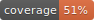
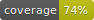

A library for Dart developers.


[](https://pub.dartlang.org/packages/ok_http2)

## okhttp



## ok_http2




## Usage

A simple usage example:

```dart
import 'package:ok/ok.dart';

main() {
  var awesome = new Awesome();
}
```

## Features and bugs

Please file feature requests and bugs at the [issue tracker][tracker].

[tracker]: http://example.com/issues/replaceme
